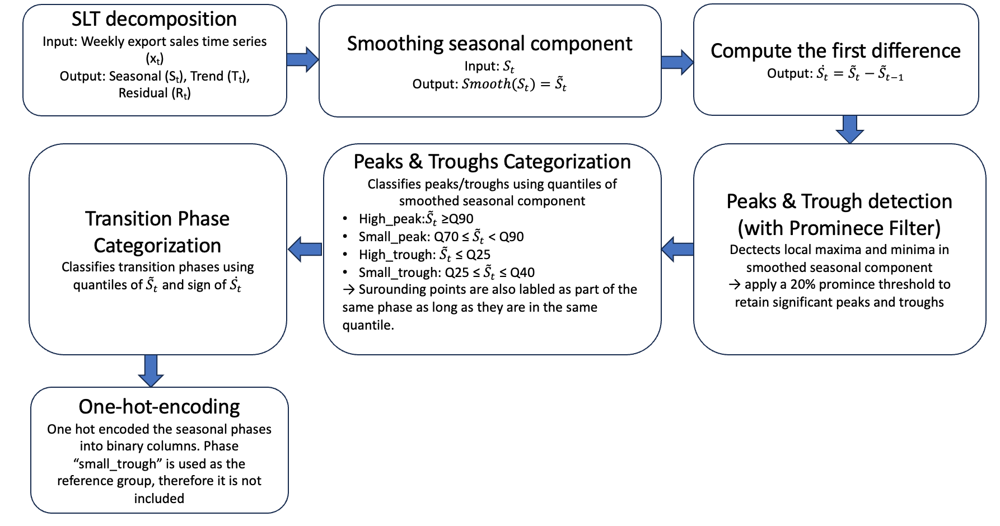

# Bachelor-thesis


### Project background 
This project develops an ARIMAX model incorporating **data-driven Seasonal Phase Signals** (referred to as ARIMAX-SPS in this file) to forecast weekly export sales, comparing its accuracy against traditional ARIMA and SARIMA models. It addresses the challenge of modeling complex, potentially dynamic seasonality in a limited dataset for a manufacturing firm with the aim of providing them with an accurate and adaptive to possible future scenarios forecasting tool.
### Research question
"Can incorporating seasonal phase signals as exogenous variables in an ARIMAX model affect forecasting accuracy compared to traditional ARIMA and SARIMA models, in a time series with a strong seasonality effect?"

### Methodology Highlights

1.  **Data Preprocessing:** Weekly sales data loaded, formatted, and checked for stationarity.
2.  **STL Decomposition:** Decomposed export sales time series into trend, seasonal, and residual components.
3.  **Phase Signal Construction:** A pipeline identifies and one-hot encodes seasonal phases from the smoothed seasonal component.
     

6.  **Model Training:**
    * **Baseline:** Fixed orders (ARIMA(20,0,3), SARIMA(20,0,3)(1,0,1)52, ARIMAX-SPS (20, 0, 3).
    * **Optimized:** Orders selected via grid search using Akaike Information Criterion (AIC).
        * ARIMA: (4,0,4)
        * SARIMA: (9,0,4)(4,0,1)52
        * ARIMAX-SPS: (20,0,4)
7.  **Evaluation:** Forecasting accuracy assessed using MAPE and MSE
  
### Package used and the installation 
To run this project:

```bash
pip install pandas matplotlib numpy statsmodels scikit-learn scipy

